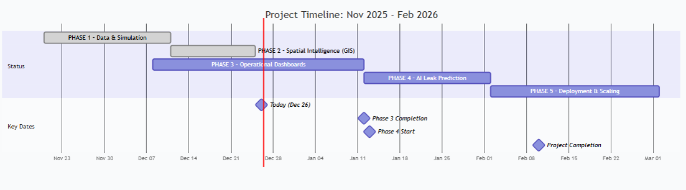
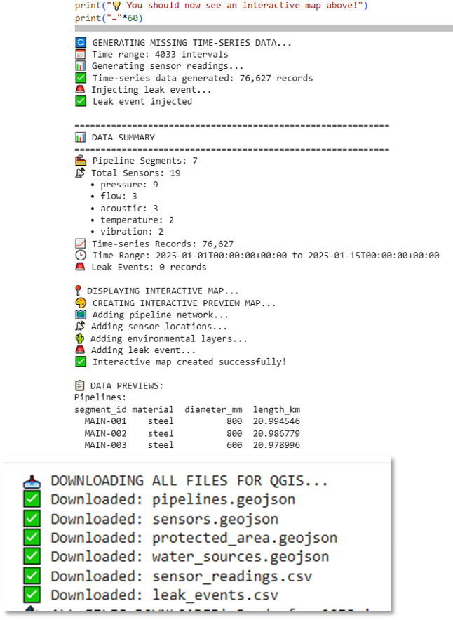
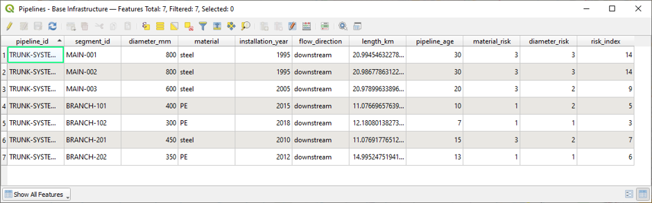
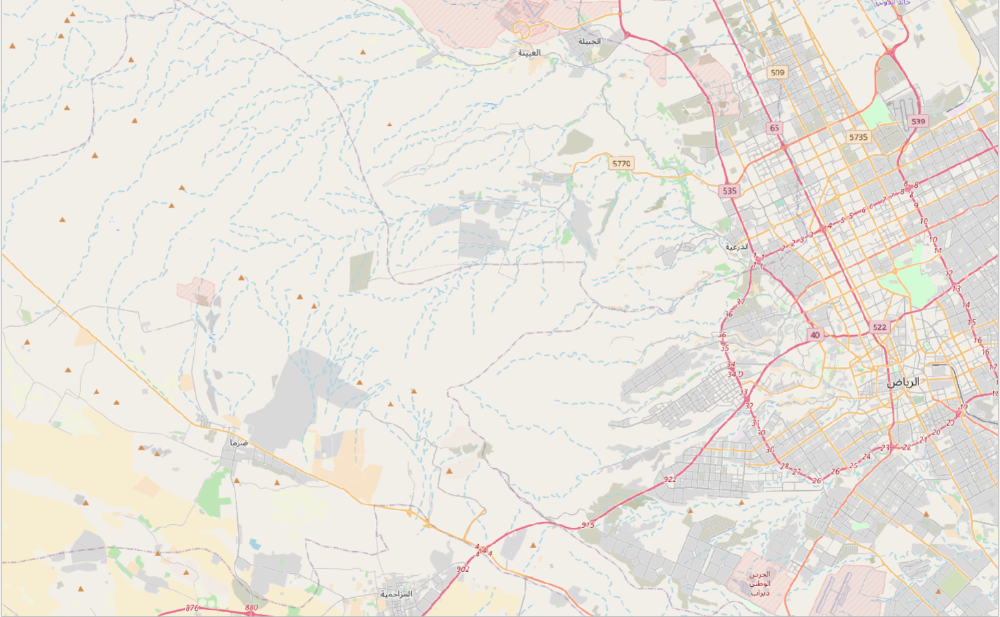
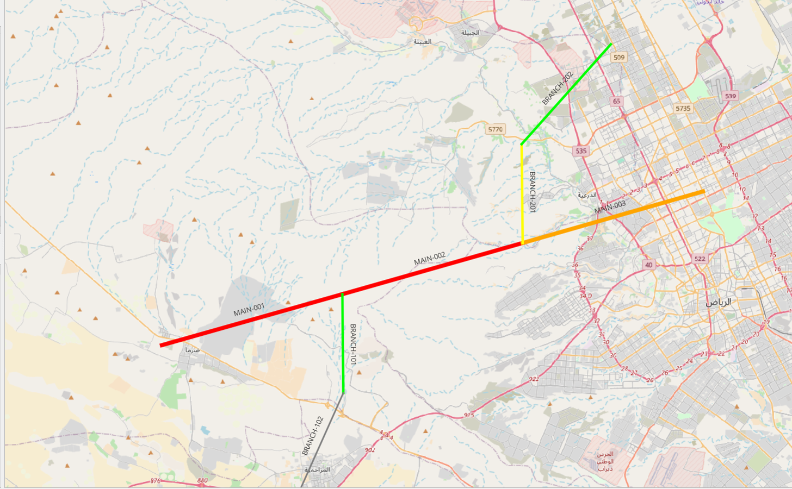
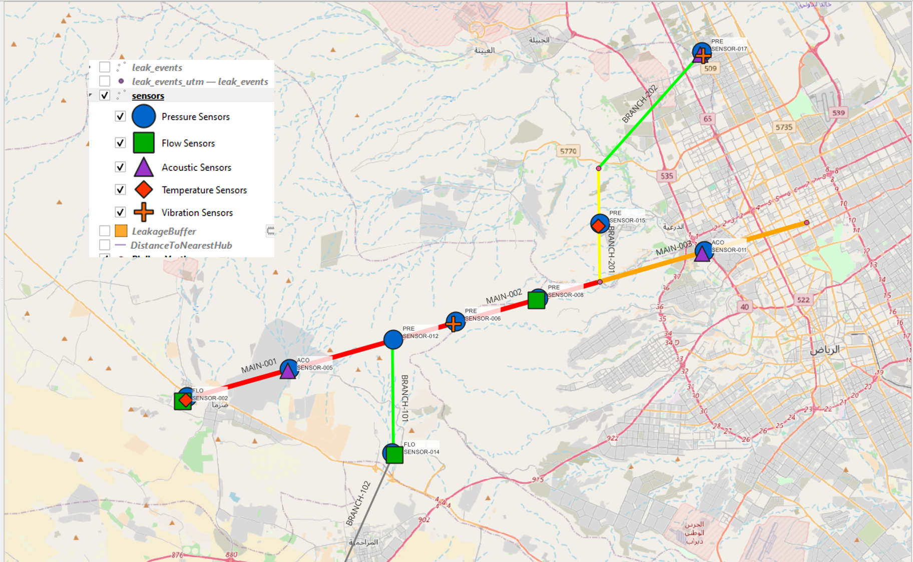
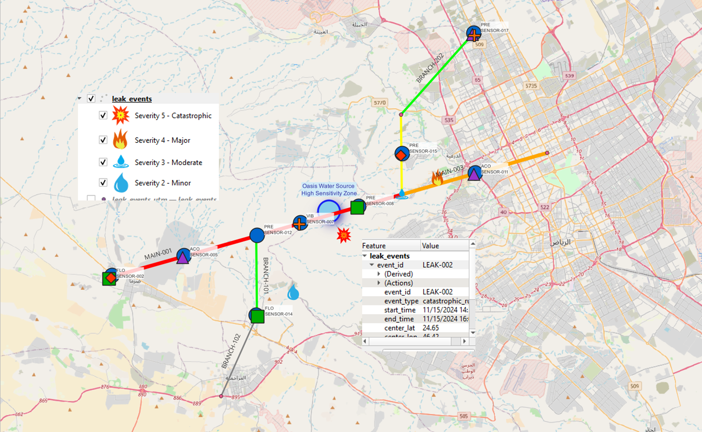
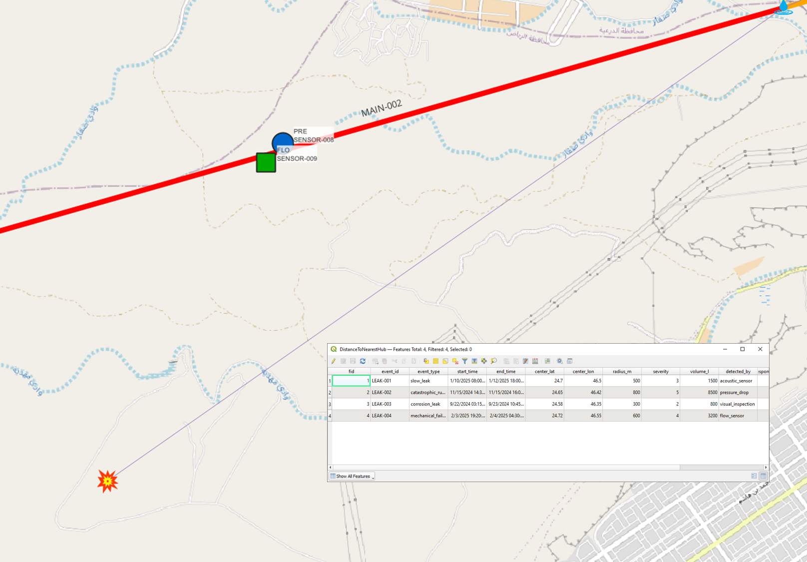
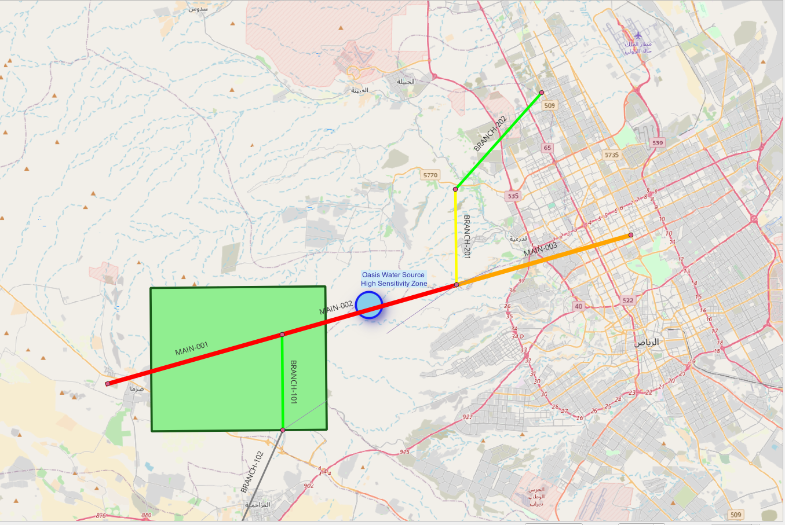

The architecture supports **incremental deployment**, scalability, and future integration with **SCADA / IoT systems**.

---

## Project Phases & Timeline

### Project Phases

- **Phase 1 – Data Modeling & Simulation**  
  Synthetic generation of pipeline networks, sensors, and leakage scenarios.

- **Phase 2 – GIS Spatial Intelligence**  
  Professional QGIS implementation with risk-based visualization and spatial analysis.

- **Phase 3 – Operational Dashboards**  
  Monitoring and KPI dashboards for operational and executive users.

- **Phase 4 – AI Leak Prediction**  
  Machine learning models for leak probability estimation and anomaly detection.

- **Phase 5 – Deployment & Scaling**  
  Enterprise integration and real-time operational rollout.

### Project Timeline

Phased delivery with clear milestones, suitable for pilot-based implementation within Oil & Gas organizations.

---

## Data Foundation & AI Readiness

Data is **synthetically generated using Python (Google Colab)** to reflect realistic Oil & Gas pipeline and sensor scenarios, then exported into industry-standard formats such as **GeoJSON and CSV** for GIS and analytics consumption.

**AI-ready attributes include:**
- Pipeline age, diameter, and material  
- Operational and environmental risk factors  
- Sensor coverage indicators  
- Composite **Risk Index** engineered for machine learning  

This structure enables a **direct transition to AI modeling and prediction**.

---

## GIS Spatial Intelligence (QGIS)

### Geographic & Cultural Context

Arabic-localized basemap representing the Middle East operational environment.

---

### Dynamic Pipeline Styling

- Line thickness reflects pipeline diameter  
- Color represents risk level  
- Line patterns distinguish material types  
- Visual hierarchy aligned with Oil & Gas cartographic standards  

---

### Sensor Network – Data-Driven Styling

Sensors are styled dynamically based on:
- Sensor type  
- Monitoring role  
- Operational criticality  

This enables **coverage assessment, optimization, and gap analysis**.

---

## Leakage Analysis & Risk Assessment

- Custom leakage symbology  
- Severity classification via attributes  
- Historical incident visualization  

---

### Distance-Based Spatial Analysis

Automated distance calculations between sensors and leakage points support:
- Detection efficiency evaluation  
- Sensor placement optimization  
- Early warning design  

---

### Buffer Zone Analysis

Pipeline buffer zones enable:
- Impact zone identification  
- Preventive monitoring design  
- Environmental and safety planning  

---

### Environmental Protection Focus

Spatial intelligence includes:
- Water sources  
- Protected environmental areas  
- High-consequence impact zones  

Supporting **HSE objectives and regulatory compliance**.

---

## AI & Analytics Roadmap

Artificial Intelligence is positioned as an **operational decision engine**, not an experimental component.

Planned capabilities include:
- Leak probability scoring per pipeline segment  
- Predictive risk heatmaps  
- Maintenance prioritization  
- Environmental impact forecasting  

Further details are documented in `docs/ai-roadmap.md`.

---

## Business Value

- Early leak detection and prevention  
- Reduced environmental and operational risk  
- Risk-based maintenance prioritization  
- Improved regulatory compliance  
- Executive-level visibility and decision support  

---

## Intended Audience

- National Oil Companies (NOCs)  
- Pipeline Integrity & HSE Teams  
- Digital Transformation Leadership  
- AI & Data Strategy Stakeholders  

---

## Repository Structure

oil-pipeline-leak-detection-platform/
│
├── README.md
├── visuals/
│ ├── ProjectCover.png
│ ├── EndToEndVision.png
│ ├── ProjectPhases.png
│ ├── ProjectTimeline.png
│ ├── DataSourceAndModels.png
│ ├── AI_ReadyData.png
│ ├── BaseMap.png
│ ├── DynamicStyledPiplines.png
│ ├── DataDrivenSessorsStyling.png
│ ├── LeakageAnalysis.png
│ ├── LeakageDistanceAnlaysis.png
│ ├── PiplinesBufferZonesAnalysis.png
│ └── ProtectedAreasAndWaterSource.png
│
├── docs/
│ ├── architecture.md
│ ├── ai-roadmap.md
│ └── deployment-approach.md
│
└── DISCLAIMER.md

## Disclaimer

This repository is provided for **professional demonstration and portfolio purposes only**.  
All data, visuals, and scenarios are **synthetic** and do not represent real operational assets.

**Essam Afifi**  
Digital Transformation & AI Consultant – Oil & Gas  
GIS • Data Intelligence • AI-Driven Decision Support  

📧 esstoronto@gmail.com  
🔗 LinkedIn: https://www.linkedin.com/in/essam-afifi

